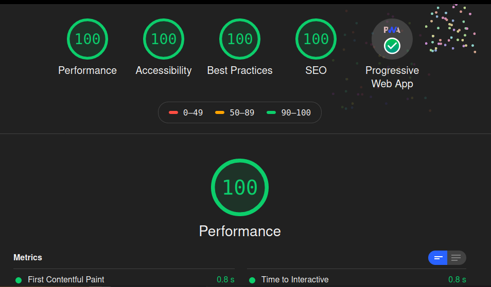

# IGMRRF

## HTML CSS \$ JavaScript

Saw a simple HTML site that had a lighthouse rating of 100% rating on Performance, Accessibility, Best Practice and SEO. :surprised:

So, I decided to make mine with addition of passing the PWA rating also.:wink:

How to run Lighthouse :

    click the "Rating Link"

Might run to 95% sometimes so don't expect perfection :smile:

ON PC

Ctrl + Shift + R or Shift + F5 to hard reload.
